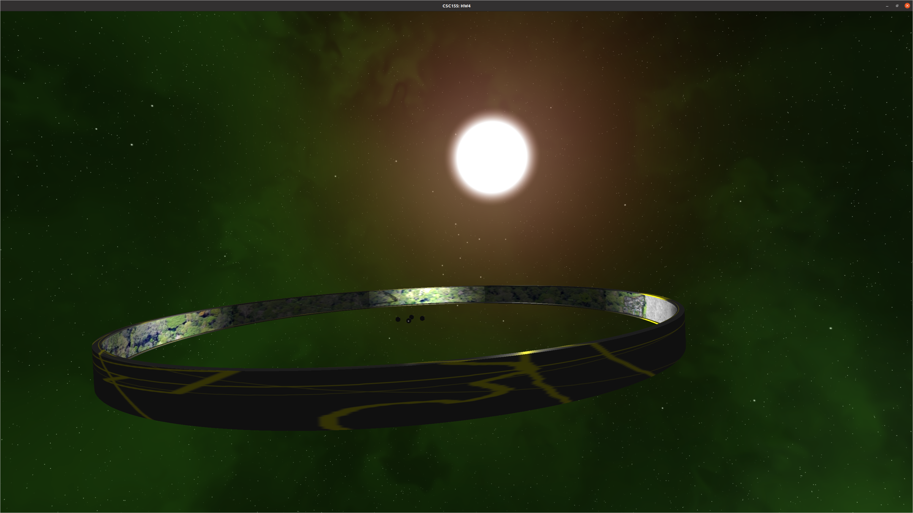
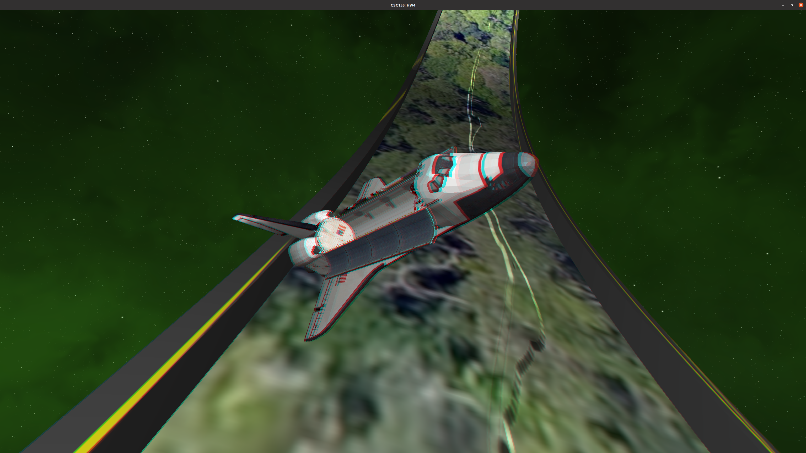

# Ring Habitat
Paul McHugh  
CSC155 Spring 2020  

## Screenshots

  
  

## Description of Project
The program is a OpenGL application for linux that is written in C++.
The scene consists of a ringworld which is textured with a jungle, a sandy area, and the CSUS campus.
There are four spotlights in the center of the scene that illuminate the daytime
parts of the ring-world.  The golden user controllable light uses omni-directional
shadow mapping and casts light and shadows in all directions.  The space shuttles in the scene are 
positioned in such a way as to emphasize the omni-directional capability of the light.
The light is between the two shuttles, and causes both to cast shadows.

### Lighting
The renderer supports multiple light sources and supports abmient, positional, directional, and spotlights.
All light types cast shadows appropriate to their nature, and all lights can be colored. 

## World Objects

The world contains  

1. One ringworld
2. Four fixed silver spotlight "generators" in the ring center.
3. One gold moveable/toggleable positional light which casts light and shadows omni-directionally
4. Two space shuttles

While it is not a world object in the sense that it is not a model, the world also contains
a directional light.  It originates from the sun in the skybox.

## Features

The program supports

1. Multiple lights and lighting and shadow mapping (up to 7)
2. PCF soft shadows
3. Blinn-Phong shaders
4. Uses a skybox which uses a opengl cubemap.
5. Uses normal mapping
6. Uses depth mapping with a tessalation shader
7. Uses a geometry shader to discard the primitives that make up the user light giving a dissolving effect.  This occus when the light is turned off using the `T` key
8. Uses a geometry shader and 3D noise map to make dissolving object effect for the golden light when `T` is pressed.
9. Supports rendering the scene as an anaglyphic image. (Use the `G` key to toggle the anaglyph between off/red-cyan/green-purple)

## Interface

A help message is printed to stdout at launch.  Type '`?`' to see it again.
The camera uses the standard W/A/S/D keys to move, and uses the arrow keys to pitch and pan.  
You can use the square bracket keys to roll '`[`' is roll left.  '`]`' is roll right.
Use ^W or ^Q to exit the application.  
**The key `T`** toggles the toggleable light.  The light will start to dissolve when turned off.  
**The key `P`** toggles the progression of time/rotations/orbits, but does not inhibit
you from interacting with the gold spotlight.  
**The key `G`** toggles the anaglyph rendering between off/red-cyan/green-purple.
**The spacebar** can be used to turn on/off the world axis and other debugging info.  
Left click to pick up the golden light.  Once it is selected it will float in front of the user
until it is dropped by another left click.  
**For further information on the interface see the console output that is printed after the program launches.**

## Build instructions
To build this program

1. Install GLEW and glfw using  
```sudo apt install libglfw3-dev libglew-dev```
2. Download and build SOIL2. Available at [https://github.com/SpartanJ/SOIL2](https://github.com/SpartanJ/SOIL2)
3. Make lib and include directories in the project home directory  
```mkdir lib include```
4. copy `libsoil2.a` from `<dir where you put SOIL>/bin/linux` to `project/lib`
5. copy the directory `<dir where you put SOIL>/src/SOIL2` to `project/include`
6. run make

\pagebreak

## Resource origins
### Shuttle model and texture
**shuttle.obj**  
**spstob\_1.jpg**  

  NASA 3D Resources, [http://nasa3d.arc.nasa.gov/](http://nasa3d.arc.nasa.gov/)  
  NASA website states these are available for public non-commercial and commercial use.

### Sun texture
**sun\_euv.png**  
I cropped the image before using it.

  Acquired from NASA [https://svs.gsfc.nasa.gov/vis/a010000/a011200/a011255/Timelapse\_Sun\_2k.jpg](https://svs.gsfc.nasa.gov/vis/a010000/a011200/a011255/Timelapse\_Sun\_2k.jpg)  
  Works of the US Governemnt are generally not subject to copyright  
  [https://www.law.cornell.edu/uscode/text/17/105](https://www.law.cornell.edu/uscode/text/17/105)  
  The NASA Media Usage Guidelines (available at
[https://www.nasa.gov/multimedia/guidelines/index.html](https://www.nasa.gov/multimedia/guidelines/index.html)
) say that  
```
NASA content - images, audio, video, and computer files used in the rendition of
3-dimensional models, such as texture maps and polygon data in any format - 
generally are not copyrighted. You may use this material for educational or informational 
purposes, including photo collections, textbooks, public exhibits,
computer graphical simulations and Internet Web pages.
This general permission extends to personal Web pages.
```
### Test  texture, normal map, and depth map
Personally created using GIMP

**rw\_test.png**  
**rw\_test\_depth.png**  
**rw\_test\_norm.png**  

### Final normal map and depth map
I created the final normal map and depth map using GIMP

**rw\_norm.png**  
**rw\_depth.png**

### Skybox
The skybox was generated using a skybox generator available at  
[http://wwwtyro.github.io/space-3d/#animationSpeed=1&fov=80&nebulae=true&pointStars=true&resolution=1024&seed=58rb5yl3wqk0&stars=true&sun=true](http://wwwtyro.github.io/space-3d/#animationSpeed=1&fov=80&nebulae=true&pointStars=true&resolution=1024&seed=58rb5yl3wqk0&stars=true&sun=true)

I possess the copyright.

### Ring world texture
The ring world texture uses three images which I edited together using GIMP

**rw\_texture.png**

I created the outer surface of the ringworld texture.
The inner surface of the ring world consists of the following images

#### Google maps satellite image of CSUS
Acquired from Google Earth

  Google's guidelines permit usage of images from Google Earth as long as they are attributed,
  and not used commercially.  
  [https://www.google.com/permissions/geoguidelines/](https://www.google.com/permissions/geoguidelines/)

#### Photo of the Amazon rainforest by Niel Palmer
I acquired this image from Wikimedia Commons.

**Brazilian\_Amazon.jpg**

  The webpage I acquired it from says it is licensed under the permissive
  Creative Commons Attribution-Share Alike 2.0 Generic license.  
  [https://commons.wikimedia.org/wiki/File:Brazilian_Amazon.jpg](https://commons.wikimedia.org/wiki/File:Brazilian_Amazon.jpg)

#### "Black And White Sand Grains" by Ken Kistler
I acquired this image from PublicDomainPhotos.net

  The website says that the image licensed under the Creative Commons CC0 license.  
  The CC0 license is described as a license underwhich the licensor waives all copyright rights to the greatest extent possible under law.  
  [https://www.publicdomainpictures.net/en/view-image.php?image=88241&picture=black-and-white-sand-grains](https://www.publicdomainpictures.net/en/view-image.php?image=88241&picture=black-and-white-sand-grains)

The rw\_texture.png image is licenced under the Creative Commons Attribution-Share Alike 2.0 Generic license.


\pagebreak

